# NOVUM

**Onboard science triage for a planetary rover.** A rover captures far more
imagery than its downlink can carry. NOVUM decides what to send.

## The result

Replaying 856 real Mastcam frames across 27 downlink windows, **at an identical
bit budget**:

| Selection policy | Natural-science frames delivered | Science yield |
|---|---|---|
| **FIFO** — send oldest first | 26<!--@FIFO_NATURAL_SENT--> of 169<!--@NATURAL_TOTAL--> | **15.4%**<!--@FIFO_YIELD--> |
| **NOVUM** — rank by novelty | 94<!--@NOVUM_NATURAL_SENT--> of 169 | **55.6%**<!--@NOVUM_YIELD--> |
| *Oracle* — reads the labels; cannot run onboard | 107 of 169 | *63.3%*<!--@ORACLE_YIELD--> |

**3.6×**<!--@NOVUM_VS_FIFO_RATIO--> the science, for the same bits — and 88% of
what a policy with ground truth could have achieved. "Natural science" means
Mars-made novelty: veins, meteorites, broken rock. Not the rover's own drill
holes and wheel tracks, which are novel to a detector and worthless to a
geologist, and which NOVUM learns to stop paying for.

The harder result is what happens when the model does not fit the processor.
Put the largest model on the RAD750 that Curiosity actually flies and it affords
**0.6**<!--@RAD750HW_SNAPDRAGON_SCORES--> novelty scores per window — less than
one — so it scores nothing, ranks nothing, and delivers
**0.000**<!--@RAD750HW_SNAPDRAGON_YIELD-->. Accuracy you cannot afford to compute
is not accuracy.

### See it

```bash
git clone --depth 1 <repo> && cd novum
docker compose -f docker/docker-compose.yml up
```

A mission-control console on <http://localhost:3000>: what the rover captured on
the left, what reached Earth on the right, the decision in between. **No dataset
download, no training step, no API key, no login.** The full cross product of
runs — 3 processors × 3 model tiers × 6 downlink budgets × 2 adaptation modes ×
3 policies, 324 replays — is precomputed and committed, so every control
responds instantly.

What that actually costs, measured rather than promised:

| Step | Time | Note |
|---|---|---|
| `git clone --depth 1` | ~10 s | 20 MB. A full clone is 142 MB — history holds the binary artifacts. |
| `npm ci` + `next build` | ~15 s | measured from a fresh clone |
| API image | ~1 min | pip install of fastapi, uvicorn, numpy — no torch |
| **Console usable** | **well under a minute** after the images exist | |

The first `docker compose up` on a machine with no cached base images spends
most of its time pulling `python:3.12-slim` and `node:22-slim`; that is network,
not this project. Once built, `up` is a few seconds. If you have Python to hand
and want to skip Docker entirely, `make web-install && make web` serves the same
console from the same committed data.

Without the API container the console still works — every panel is precomputed —
and the mission brief says so rather than failing silently.

---

## Problem statement

Curiosity has returned on the order of a million images across a decade. The
bottleneck was never the camera; it was the relay pass. A Mars orbiter is
overhead for a few minutes at a time, and the bits that fit in that window are
the only science that reaches Earth that sol. Everything else waits, and some of
it ages out of onboard storage having never been seen by anyone.

So the interesting question is not "can a model classify Martian terrain". It is:

> Given a flight processor already busy driving the rover, and a downlink window
> that closes in eight minutes, **which frames do you send?**

That question has two constraints, and they pull against each other:

| Budget | Scarce because | Consumed by |
|---|---|---|
| **Downlink (bits)** | the relay window is short and shared | frames you *transmit* |
| **Compute (cycles)** | the flight CPU is shared with driving, thermal, comms | frames you *score* — transmitted or not |

Optimising either alone gives the wrong answer. A model good enough to rank
frames perfectly is worthless if scoring one frame costs more cycles than the
rover has between windows. A model cheap enough to run on everything is
worthless if it fills the downlink with sand.

Almost every "AI for space imagery" result reports accuracy on a fixed test set
and stops. That measurement cannot see the trade this problem is made of.

---

## Solution description

NOVUM scores each captured frame by **novelty** — reconstruction error of a
model fitted to *typical* terrain — and selects what to transmit under both
budgets at once.

Three things make it a system rather than a model:

**1. Novelty is defined causally.** The static evaluation asks "is this frame
unlike the training set". The simulator asks the strictly harder question the
rover actually faces: *is this unlike what has been seen so far*. Frames arrive
in sol order across 27 windows; a frame not selected stays in an age-limited
buffer and competes again next window, or expires unsent and is counted. Nothing
is reordered, and no future frame informs a past decision.

**2. Both budgets bind, and the second one bites.** Scoring costs cycles. When
the buffer holds more frames than the cycle budget can score, a cheap prefilter
(per-frame variance plus spectral spread, ~14% of a PCA score) decides what is
even worth looking at. Frames never scored cannot be selected — a second-order
scarcity that most treatments hand-wave, and that turns out to dominate the
result on real flight hardware.

**3. The report is generated where the bits are cheap.** The rover sends a
decision log of a few hundred bytes per window. A language model **on the
ground** turns that into an operator briefing. No imagery crosses the link for
the sake of the report, and the model runs where power and bandwidth are free.

The deliverable is a **mission-control console**: the frames themselves on
screen, because the whole argument is about which images were worth their bits
and that is not an argument you can make with bar charts.

---

## AI approach and architecture

```mermaid
flowchart LR
    subgraph rover["ONBOARD — flight processor, both budgets scarce"]
        direction TB
        CAM["Mastcam<br/>856 frames, 6 bands<br/>sols 13–1666"]
        BUF["frame buffer<br/><i>age-limited, retained</i>"]
        PRE["cheap prefilter<br/><i>variance + spectral</i><br/>~123k FLOP/frame"]
        SCORE["novelty model<br/><i>PCA or conv-AE</i><br/>0.87M–49.2M FLOP/frame"]
        SEL["two-budget selection<br/><i>bits AND cycles</i>"]
        CAM --> BUF --> PRE -->|"what is worth<br/>scoring at all"| SCORE --> SEL
        BUF -.->|"expires unsent<br/><i>counted, never silent</i>"| X(("lost"))
    end

    subgraph link["RELAY PASS — the scarce resource"]
        direction TB
        FRAMES["selected frames<br/><b>~25% of what was captured</b>"]
        LOG["decision log<br/><b>a few hundred bytes/window</b><br/><i>counts, budgets, constraint</i>"]
    end

    subgraph ground["GROUND — power and bandwidth are free"]
        direction TB
        FACTS["fact layer<br/><i>labelled quantities</i>"]
        LLM["language model<br/><i>arranges prose only</i>"]
        BRIEF["operator briefing"]
        CONSOLE["mission-control console"]
        FACTS -->|"placeholders,<br/>never values"| LLM --> BRIEF
        FACTS -->|"substituted after<br/>generation"| BRIEF
    end

    SEL --> FRAMES --> CONSOLE
    SEL --> LOG --> FACTS

    style rover fill:#2d2a32,stroke:#8b7fa8,color:#e8e6ea
    style link fill:#3a3325,stroke:#c0a050,color:#f0ece0
    style ground fill:#1f2d2a,stroke:#6fa88b,color:#e8e6ea
```



**The novelty model.** Three tiers, one scoring rule — reconstruction error in a
standardized space — differing only in capacity, so the comparison is fair.
`rad750` is PCA with 64 components fitted by streaming randomized SVD (one
matrix-vector product per score, no scikit-learn, because `core/` is imported by
the serving layer). `myriad` and `snapdragon` are convolutional autoencoders of
increasing size. Every tier reports FLOPs per inference next to its ROC AUC,
because that pairing *is* the finding.

**The language model writes no numbers.** This is the part worth stealing.
A numeric validator catches a figure with no basis in the source; it cannot catch
a *correct* figure under a *wrong label* — "604 natural frames expired" when 604
counts every class. Both halves are true; only the join is false. So generation
is constrained rather than checked: `core/ground/facts.py` builds a labelled
`Fact` per quantity, the model receives placeholders **and their labels but never
their values**, and values are substituted back after generation. A reply
containing any digit of the model's own is discarded and a deterministic template
is published instead. Hallucinated numbers and mislabelled ones both become
unrepresentable rather than merely detectable.

**The one architectural rule.** No training dependency may be importable from
the serving layer. Enforced in three places, not just documented: a test that
imports `api.main` in a clean subprocess and fails if torch appears in
`sys.modules`, the same check at Docker build time, and a lazy model registry so
listing the autoencoder tiers never imports the module that imports torch.

---

## Selected challenge theme

**August Challenge: Advance Space Exploration with AI.**

NOVUM targets the specific bottleneck that limits planetary science return:
onboard triage under simultaneous downlink and compute constraints, evaluated on
real Mars Science Laboratory imagery against the processor Curiosity actually
carries. The flight-hardware tiers are not hypothetical — the RAD750 flies on
Curiosity and Perseverance, and the Myriad 2 flew on ESA's Phi-Sat-1, the first
in-orbit demonstration of onboard AI inference for downlink triage.

---

## How IBM Bob was used

See [`docs/bob-usage.md`](docs/bob-usage.md) for the detailed account, including
where Bob's output needed correction.

In summary, Bob was used on three parts of this project:

- **The OpenRouter integration** (`core/ground/llm_provider.py`) — the provider
  client, request shape, error handling and cost accounting for the ground-side
  report. This is the part Bob contributed most of.
- **Model training**, in part — the tier training path under `scripts/train.py`
  and `core/models/`.
- **The console interface**, in part — components under `web/src/`.

The remaining work — the simulator, the two-budget selection, the experiments,
and the fact-layer rework that stopped the model writing figures — was done with
other assistance or by hand; `git log` carries the trailers. That division is
stated plainly in the linked document rather than blurred, because a reader who
checks the history should find it says what this section says.

---

## What we found

Four results, stated plainly. Two of them are inconvenient for the premise the
project started with, and they are the more useful two.

### 1. Model capacity buys nothing here

Lift the cycle budget entirely — every buffered frame gets a real novelty score,
only the downlink binds — and all three tiers land in
**0.503-0.509**<!--@UNLIMITED_YIELD_BAND--> science yield. A 57× span in FLOPs
per inference, and the spread is six thousandths.

So every difference reported elsewhere in this project is a **compute effect,
not an accuracy effect**. The expensive models are not better at finding Martian
novelty; they are worse at fitting in the machine. That is not the result a
project built around three model tiers wants, and it is the one the measurement
gives.

### 2. On the processor that actually flies, the biggest model delivers nothing

Pin the silicon to a RAD750 — every model charged its real cost, against the
cycle budget that processor was provisioned for — and the ordering inverts:

| Model on RAD750 hardware | Scores affordable per window | Science yield |
|---|---|---|
| rad750 (PCA) | **31.7**<!--@RAD750HW_RAD750_SCORES--> | **0.556**<!--@RAD750HW_RAD750_YIELD--> |
| myriad (conv-AE) | 2.9<!--@RAD750HW_MYRIAD_SCORES--> | 0.053<!--@RAD750HW_MYRIAD_YIELD--> |
| snapdragon (conv-AE) | 0.6<!--@RAD750HW_SNAPDRAGON_SCORES--> | 0.000<!--@RAD750HW_SNAPDRAGON_YIELD--> |

The largest model cannot afford one full score per window. It scores nothing, so
a score-ranking policy has nothing to rank, so the downlink goes unused while the
buffer fills and ages out. A deployed system would fall back to FIFO's
15.4%<!--@FIFO_YIELD-->; the zero is reported as what the measured configuration
does, not as a claim that anyone would fly it.

Move to a 1 W Myriad 2 accelerator and the ordering is restored. That is the
Phi-Sat-1 trade, with a number attached.

### 3. Learning what is *ordinary* is enough, and it is fast

`frozen` is trained on the ground and uplinked. It is also **optimistic by
construction**: its training set spans the whole mission, including sols the
rover has not reached. `online` starts knowing nothing about the terrain,
bootstraps on the first sols, and refits in flight on unlabelled frames.

Online reaches **0.462**<!--@ONLINE_YIELD--> against FIFO's
0.154<!--@FIFO_YIELD_DECIMAL-->, with no prior knowledge of the body it is
looking at. The natural share of what it transmits climbs from 0.152 in the
first five windows to 0.686 in the last five. A novelty detector arriving at an
unvisited body does not need to be told what is interesting — it needs to learn
what is ordinary, and the cold-start curve shows how fast that happens.

### 4. Scoring every frame makes the PCA tier *worse*

The uncomfortable one. Lift the compute budget for `rad750` — score everything,
no triage — and science yield **falls** from 0.556<!--@RAD750HW_RAD750_YIELD-->
to **0.509**<!--@RAD750_ALL_SCORED_YIELD-->, a change of
**-0.047**<!--@RAD750_ALL_SCORED_DELTA-->.

More information, worse outcome. The explanation is that the cheap prefilter is
not merely a cost-saving approximation of the model — it is a **second opinion
with a different bias**. It ranks by texture energy and spectral unusualness,
which happens to favour exactly the busy, high-variance scenes that natural
geology produces; the rover's own smooth machined hardware scores low. Removing
it removes that bias, and the model's own ranking — which is near chance on
rover-made novelty — fills the recovered capacity with drill holes.

Prefilter recall of **0.828**<!--@RAD750_PREFILTER_RECALL--> confirms this is not
a ceiling being hit: the triage stage was not starving the model of good
candidates. It was improving them.

We tried the obvious fix once, honestly. A top-4 low-rank prefilter built from
the model's own principal subspace — cheaper than a full score, better aligned
with the objective — improved recall exactly as intended (0.828<!--@RAD750_PREFILTER_RECALL--> → 0.846) and
yield still fell (0.556<!--@RAD750HW_RAD750_YIELD--> → 0.527). A prefilter better aligned with the model is a
*weaker* second opinion. The cheap statistic stays, and the result is reported
either way.

---

## Provenance: every number traces to an artifact

Headline figures appear in this README, in `results/`, and in the mission brief.
They are not allowed to disagree.

No document holds a figure of its own. `core/figures.py` reads every published
quantity out of the artifacts that produced it — `runs/sim/<run>/summary.json`
and `artifacts/metrics/*.json` — and each figure in prose carries an invisible
marker naming its source:

```markdown
NOVUM delivers **55.6%**<!--@NOVUM_YIELD--> of the natural-science frames
```

```bash
make check-figures     # fails if a figure disagrees with its artifact
```

A regenerated simulation that moves a number turns every document quoting it red.
Adding a figure to the prose means adding it to `core/figures.py` first —
deliberate friction, because a number nobody can source is a number nobody
should print.

**The published numbers on this page were produced by simulation run
`20260811-092134`<!--@SIM_RUN_ID-->** from commit
`8006e687`<!--@SIM_GIT_COMMIT-->. `make check-figures --list` prints every figure
with its source file.

## Model tiers

Each tier is a config, named for the class of flight processor it targets. All
three are implemented end to end, score novelty the same way — reconstruction
error of a model fitted to typical terrain, in the same standardized space —
and differ only in how expressive that model is. That is what makes the
comparison fair.

| Tier | Hardware it represents | Model | Params | FLOPs/inf |
|---|---|---|---|---|
| **rad750** | BAE RAD750, ~200 MHz, no SIMD — Curiosity & Perseverance's CPU | PCA, 64 components | 399k | 0.87 M |
| **myriad** | Intel Movidius Myriad 2 VPU, ~1 W — flew on ESA's Phi-Sat-1 | conv AE, base 16, depth 2, latent 32 | 544k | 9.4 M |
| **snapdragon** | Snapdragon-class SoC, ~5–10 W — Ingenuity heritage; deliberately overprovisioned | conv AE, base 32, depth 3, latent 128 | 2.29M | 49.2 M |

**rad750.** Scoring must cost a handful of dot products. PCA gives exactly
that: the model is a `k × D` matrix, inference is one matrix-vector product,
and novelty is the energy the principal subspace fails to explain. Fitting uses
a **streaming randomized SVD** through chunked passes over the memmap (peak
`O(n·l + D·l)`, not `O(n·D)`). No scikit-learn: `core/` is imported by the API,
and the API has no training deps. Component signs are canonicalised
(`svd_flip`) so artifacts are comparable across BLAS implementations.

**myriad / snapdragon.** One conv autoencoder implementation, scaled:
`[Conv(3×3, stride 2) + BN + ReLU] × depth`, dense latent bottleneck, mirrored
transposed-conv decoder, MSE loss over typical terrain only. Trained CPU-only,
streaming shuffled minibatches straight off the memmap (fancy-indexed per
batch; the split is never loaded whole), deterministic per seed: torch seeded,
numpy seeded, and batch order owned by a seeded numpy Generator — there is no
DataLoader worker pool to introduce nondeterminism. Early stopping watches
reconstruction loss on `validation_typical`. Measured training wall clock:
myriad ~2 min, snapdragon ~9 min (budgets: 15 min and 1 h).

---

## Results

The full comparison lives in [`results/RESULTS.md`](results/RESULTS.md) —
regenerate it any time with `make report` (seconds, reads stored sweep metrics,
never retrains). Summary — 426 `test_typical` vs 430 `test_novel/all`, chance
0.502, reference ROC AUC 0.65 (Kerner et al. 2020 conv AE). **The headline is
precision@window**: the downlink window is derived from config
(8,000,000 bits ÷ 49,152 bits/frame = **162 frames**), and only frames inside
it get transmitted — precision at exactly that k is what the downlink delivers.

| tier | p@window (162) | ROC AUC natural | ROC AUC rover | ROC AUC aggregate | FLOPs/inf | fits a RAD750? |
|---|---|---|---|---|---|---|
| rad750 | 0.702 ± 0.003 | 0.887 | 0.478 | 0.639<!--@RAD750_ROC_AUC--> ± 0.001 | 0.87 M | **yes** (13%) |
| myriad | **0.745 ± 0.010** | 0.888 | **0.534** | **0.673 ± 0.002** | 9.4 M | no — 1.4× over |
| snapdragon | 0.718 ± 0.003 | 0.889 | 0.498 | 0.651 ± 0.005 | 49.2 M | no — 7.4× over |

The k choice is not cosmetic — it decides the winner. At k=10 snapdragon looks
perfect (1.000 ± 0.000, vs 0.867 for the others) and leading with that number
inverts the conclusion; at the operational k=162 **myriad wins and snapdragon
is second**. RESULTS.md carries the full precision@k curve so the crossover is
visible instead of buried in JSON. Small-k precision stays reported as a
top-of-ranking diagnostic.

Four findings, in the order they matter:

1. **Natural geology is saturated by the linear model.** All three tiers land
   at 0.887–0.889 on Mars-made novelty. 57× more FLOPs buys +0.002. If the
   mission's question is "show me terrain unlike what the rover has driven
   over", a RAD750 running PCA already answers it — and everything above it is
   spending cycles on nothing.

2. **What extra compute actually buys is the rover's own footprint.** The
   myriad autoencoder beats PCA by +0.056 on rover-made novelty (0.534 vs
   0.478, sd ≈ 0.004 — a real gap, not seed noise), lifting drill-hole
   0.60→0.65 and dump-pile 0.46→0.58. That is the only place the nonlinear
   model earns its 11× FLOPs, and it is what pushes the aggregate to
   **0.673, above the published 0.65 reference**.

3. **More compute is not monotone.** The snapdragon model — 4× the params, 5×
   the FLOPs of myriad — is *worse* than myriad on rover-made novelty (0.498)
   and on the aggregate (0.651) — and at the operational point it loses too:
   p@162 of 0.718 vs myriad's 0.745. Where it wins is the extreme top of the
   ranking: **precision@10 = 1.000 across every seed** (myriad 0.867). The
   big model is more certain about its most confident picks and no better at
   filling a real downlink window. At the 162-frame window the shipped configs
   derive, that trade buys nothing for 5× the cycles; it would only pay on a
   mission whose window is an order of magnitude smaller.

4. **Neither autoencoder fits the processor the rover actually flies.** On a
   RAD750's cost model the myriad net needs 1.4× and the snapdragon net 7.4×
   the per-frame cycle budget. The myriad tier's gains are real but they
   require flying an accelerator — which is exactly what ESA did on Phi-Sat-1,
   and exactly the trade this project exists to make measurable.

There is also an argument that the rad750/myriad gap matters less than it
looks: rover-made "novelty" — drill holes, wheel scuffs, dump piles — is
terrain the mission already knows about. A triage system near chance on those
classes is arguably *filtering* them, which is desirable downlink behaviour.
The decomposition exists so that argument can be made (or attacked) with
numbers instead of an aggregate that hides it.

---

## The mission simulation

The static tables score a frame against the *training set*. The simulator asks
the question the rover actually faces — is this frame unlike what has been seen
**so far** — by replaying all 856 frames in sol order across 27 downlink
windows, under both budgets at once. Full results in
[`results/SIMULATION.md`](results/SIMULATION.md); `make simulate` reproduces
them in under a second from committed artifacts.

| method | science yield | wasted bits | what it is |
|---|---|---|---|
| fifo | 0.154<!--@FIFO_YIELD_DECIMAL--> | 0.325 | transmit in capture order — non-intelligent operations |
| random | 0.219 | 0.286 | the floor |
| greedy_ratio | 0.521 | 0.195 | novelty per bit |
| **score_first** | **0.556**<!--@RAD750HW_RAD750_YIELD--> | 0.160 | pure novelty ranking — the best onboard policy |
| *oracle* | *0.633*<!--@ORACLE_YIELD_DECIMAL--> | *0.081* | *reads the labels; unachievable upper bound* |

**Science yield** = of the 169 natural-class novel frames the rover captured,
the fraction that reached the ground, at an identical bit budget (25% of what
is captured, ~7.9 frames per window).

**NOVUM delivers 3.6× the science of FIFO** (+262%) and closes 84% of the
distance to a label-reading oracle. It also spends half the downlink share on
rover-made housekeeping that FIFO does (0.160 vs 0.325).

### On the processor Curiosity actually carries

The table above gives each tier a cycle budget sized to *its own* reference
processor, so all three afford ~31.7 scores per window and the compute axis
cancels. Pin the hardware instead — every model charged its real cost on one
processor, with that processor's budget — and the comparison changes completely
(`make simulate-fixed-hw HARDWARE=rad750`):

| model on a RAD750 | cycles/inference | scores affordable/window | natural frames never scored | science yield |
|---|---|---|---|---|
| rad750 (PCA) | 2.6 M | 31.7 | 29 of 169 | **0.556**<!--@RAD750HW_RAD750_YIELD--> |
| myriad (conv AE) | 28.3 M | 2.9 | 160 of 169 | **0.053**<!--@RAD750HW_MYRIAD_YIELD--> |
| snapdragon (conv AE) | 147.6 M | 0.6 | 169 of 169 | **0.000**<!--@RAD750HW_SNAPDRAGON_YIELD--> |

**On the flight-heritage processor the more accurate model does not merely lose
— it cannot run.** The snapdragon net cannot afford one full score per window,
so it never scores anything and transmits nothing; a real system would fall
back to FIFO's 0.154<!--@FIFO_YIELD_DECIMAL-->. Add a 1 W Myriad-class accelerator and the ordering
recovers (rad750 0.509<!--@RAD750_ALL_SCORED_YIELD-->, myriad 0.503<!--@UNLIMITED_YIELD_LOW-->, snapdragon 0.178) — which is precisely
the trade ESA made on Phi-Sat-1, now with a number attached.

Three more things the replay exposes that the static evaluation cannot:

1. **The tier ranking inverts.** rad750 wins the simulation (0.556<!--@RAD750HW_RAD750_YIELD-->) despite
   myriad winning the static aggregate ROC AUC. Science yield depends only on
   ranking *natural* frames, and all three tiers are statistically identical
   there (0.887–0.889) — so the cheapest model wins on the metric that matters
   operationally, and the autoencoders' advantage on rover-made classes buys
   nothing here.
2. **The compute budget bites, and unequally.** The cycle budget affords ~32
   full scores per window against a buffer of 80–180 frames, so a cheap
   prefilter decides what is even worth scoring. At rad750 scale that prefilter
   costs 14% of a full score and 1,019 frame-windows go unscored; at myriad
   scale it costs 1.3% and only 632 do. A cheaper model does not automatically
   mean more frames examined.
3. **A detector does not need to know what is interesting — it needs to learn
   what is ordinary.** `online` starts knowing nothing, bootstraps after 200
   sols on whatever it has captured (no labels), and refits every 4 windows.
   Science yield 0.556<!--@RAD750HW_RAD750_YIELD--> → **0.462**<!--@ONLINE_YIELD--> against the frozen model, which is
   optimistic by construction since `train_typical` spans sols the rover has
   not reached. The cold-start curve is the answer to "how would this work at a
   body nobody has visited": the natural share of what it chose to transmit
   goes from **0.152 in the first five windows to 0.686 in the last five**.
   FIFO is the control — its online and frozen rows are identical, so the gap
   is the model learning, not an artifact of the replay.

4. **Whether compute or bandwidth binds depends on whether the model fits.**
   With the cycle budget lifted entirely, all three models land in a narrow
   band (0.503<!--@UNLIMITED_YIELD_LOW-->–0.509<!--@RAD750_ALL_SCORED_YIELD-->) — once compute is free they are worth the same, and every
   difference above is a compute effect, not an accuracy one. When a model does
   *not* fit its hardware, compute dominates overwhelmingly (+0.45 and +0.51
   for myriad and snapdragon on a RAD750). When it does fit, bandwidth binds
   and scoring everything is actually **worse** (rad750: 0.556<!--@RAD750HW_RAD750_YIELD--> → 0.509<!--@RAD750_ALL_SCORED_YIELD-->),
   because the variance prefilter is a second filter with a different bias that
   happens to favour textured natural classes. Prefilter recall of 0.83–0.91 is
   not a ceiling being hit; the 25% downlink is.

A cheaper-but-better prefilter was tried once, honestly: ranking by the
model's own top-4 principal components (a sixteenth of a full score, so a
comparable cost). It improved recall of natural frames as intended, 0.828<!--@RAD750_PREFILTER_RECALL--> →
0.846, and yield still **fell** 0.556<!--@RAD750HW_RAD750_YIELD--> → 0.527 — a prefilter better aligned with
the model is a weaker second opinion. Reported as measured; the cheap statistic
stays.

Design decisions, and where they are argued: unselected frames are **retained**
in an age-limited buffer (200 sols) and expiries are counted, never silent;
ground-truth feedback is **off** by default because there is no ground truth
onboard (`--ground-feedback` measures what a trickle of expert supervision is
worth — it scored 0.444, slightly *below* plain online, well within noise at
~180 labelled frames). See `sim/window.py`.

---

## Ground-side mission brief

After each simulation run the rover's compact decision log can be turned into
an operator briefing **on the ground**, at zero downlink cost — the model never
sees imagery, only the few-hundred-bytes-per-window JSON that the simulator
already writes.

```bash
make report-mission RUN=20260807-100510          # LLM path (OpenRouter)
make report-mission RUN=20260807-100510 VARIANT=rad750-score_first

# Force the deterministic fallback (no key needed, always works):
make report-mission RUN=20260807-100510 OFFLINE=1
python -m scripts.mission_brief --run-id 20260807-100510 --offline
```

Outputs:

- **`results/MISSION_BRIEF.md`** — mission summary + per-window operator notes
- Per-window notes written back into each `.jsonl` record as `operator_note`
- **`runs/sim/<run_id>/report_meta.json`** — token counts, cost, validation log

### Two levels of output

**Per window** — a short operator note: frames arrived and sent, binding
constraint (bits vs cycles), cumulative science yield, prefilter recall, expiry
pressure.

**Mission summary** — a full briefing: science yield vs FIFO baseline, which
windows were compute-limited, high-expiry windows, and operational
recommendations.

### Two figures share a name and not a denominator

Both of these appear in the brief, and reading one as the other makes the
numbers look wrong when they are not. Each is labelled wherever it is printed:

| figure | denominator |
|---|---|
| `science_yield` (run) | all natural frames in the mission (169) |
| `cum_science_yield` (window) | natural frames captured **so far** — grows all mission |
| `prefilter_recall_natural` (run) | **unique** natural frames ever buffered |
| `prefilter_recall` (window) | natural frames in **that window's** buffer |

Cumulative yield is reported with its counts (`24 of 31 natural frames captured
so far`), and marked *provisional* until at least half the mission's natural
frames are in hand — otherwise window 6 reads 77.4% on a mission that finishes
at 55.6%<!--@NOVUM_YIELD-->, purely because 31 frames had been captured by then.

### Provider and model

Calls [OpenRouter](https://openrouter.ai) with the key in `.env`:

```
OPENROUTER_API_KEY=<your key>
NOVUM_REPORT_MODEL=ibm-granite/granite-4.1-8b   # default; any OpenRouter model works
```

`.env` is loaded once, at process entry, by `core.env.load_env()` — pinned to
the project root and called from every entry point that can need credentials
(`scripts/mission_brief.py`, `scripts/check_llm.py`, `api/main.py`). A real
environment variable always beats the file, and a missing `.env` is never an
error. Point it elsewhere with `NOVUM_ENV_FILE=/path/to/env`.

The model id is a config value — swap to any OpenRouter model for comparison:

```bash
python -m scripts.mission_brief --model anthropic/claude-3.5-sonnet --run-id latest
```

Before generating a brief, check the provider is actually reachable:

```bash
make check-llm                              # or: make check-llm MODEL=openai/gpt-4o-mini
```

It sends one minimal request and prints the model, latency, tokens and cost —
or the exact reason it could not, and exits non-zero:

```
env file:  .env
model:     ibm-granite/granite-4.1-8b
latency:   260 ms
result:    OK — 'OK'
tokens:    31 in + 2 out = 33 total
cost:      $0.000002 (estimated from the local pricing table)
```

### Degradation is mandatory, and it says why

If `OPENROUTER_API_KEY` is absent, rate-limited, or the request fails, the
system **still produces a report** — a deterministic template-rendered version
of the same facts, clearly marked `⚠ OFFLINE REPORT`. Nothing in the demo
depends on the key being alive.

A report that just said "LLM unavailable" gave an operator nothing to act on,
so the fallback names the cause. One of four, each with a distinct remedy:

| reason | meaning |
|---|---|
| `key_missing` | `OPENROUTER_API_KEY` is not set — add it to `.env` or export it |
| `auth_failed` | the key was rejected (HTTP 401/403) — check it is current and funded |
| `rate_limited` | HTTP 429 — retry later or slow the run |
| `request_failed` | network, timeout, or a malformed response — detail is included |
| `offline_requested` | `--offline` was passed; the provider was never called |

The reason appears in the report header, in the `⚠ OFFLINE REPORT` footer, on
stdout, and in `report_meta.json` as `skip_reason` / `skip_detail`.

### Cost

A full 27-window mission costs roughly 22 k input + 8 k output tokens.
At Granite-4.1-8b pricing (~$0.05 in / $0.10 out per million tokens):

```
~$0.0023 per run   ($0.05 × 22/1000 + $0.10 × 8/1000)
```

Token counts and the estimated cost are logged to `report_meta.json` on every
run. The Makefile target records them alongside the run.

### Number validation

Every number that appears in the model's output is checked against the source
decision log. Numbers that cannot be traced back to a source record are flagged
in `report_meta.json` and annotated in the brief.

### The model never writes a figure

A numeric validator catches a number with no basis in the source. It cannot
catch a *correct* number under a *wrong label* — "604 natural frames expired"
when 604 counts every class. Both halves of that sentence are true; only the
join is false, and by the time it is in the output the damage is done.

So generation is constrained rather than checked. `core/ground/facts.py` turns
the decision log into `Fact` objects, each of which renders as a complete,
self-labelling phrase:

```
{{N_EXPIRED_TOTAL}}  →  "Frames expired unsent: 604 across the mission,
                         all classes — not only natural"
```

The model is handed the placeholder **and its label, but never its value** — a
prompt containing no digits cannot leak one into the output. It replies in two
line kinds: a figure line is one placeholder alone; a prose line is its own
interpretation and contains neither placeholder nor digit. Values are
substituted afterwards. A reply that writes a numeral, or attaches a noun to a
placeholder, is discarded and the deterministic template is published instead —
with `unsanctioned_figures` as the reason.

The result: hallucinated figures and mislabelled ones are both unrepresentable,
not merely detectable. `validate_numbers` stays on as a backstop and costs
nothing.

---

## Mission control

```bash
make console       # precompute the atlas, mission stream and run grid (needs data)
make web-install   # once
make web           # http://localhost:3000
make serve         # the briefing endpoint, in another shell
```

Or the whole thing, on a clean machine with nothing but Docker:

```bash
docker compose -f docker/docker-compose.yml up
```

The grid build needs the dataset and a few idle cores. If neither is to hand,
`make console-modal-upload && make console-modal` runs the identical build in a
container — same code, same output, about four minutes.

A ground-station console: what the rover captured on the left, what reached
Earth on the right, and the decision in between. The frames themselves are on
screen because the entire argument is about which images were worth their bits,
and that is not an argument you can make with bar charts.

**Everything is precomputed.** `scripts/build_console.py` replays the full cross
product — 3 flight processors × 3 model tiers × 6 downlink budgets × 2
adaptation modes × 3 policies = 324 runs — and commits the result. Dragging the
slider is a dictionary lookup, so it tracks the pointer; the app needs no GPU,
no dataset and no model at runtime. The grid is in the repository, so a fresh
clone has a working console with no download and no training step.

The five controls are independent, not a preset picker, because their cross
product *is* the finding. Put the snapdragon model on the RAD750 and watch it
collapse: one novelty score costs more cycles than the window has, so the
prefilter promotes frames nothing can score, nothing gets ranked, and the
downlink sits idle while the buffer fills and ages out.

### Verified

| | |
|---|---|
| default view | 94 of 169 natural frames delivered, **3.6×** FIFO at an identical bit budget |
| snapdragon on RAD750 | one score costs 147,628,032<!--@RAD750HW_SNAPDRAGON_CYCLES--> cycles; the window affords **0.56** — yield collapses to zero and the downlink sits idle |
| online adaptation | cold start visible as the curve climbing from zero; yield 46.2% against frozen's 55.6%<!--@NOVUM_YIELD-->, because frozen's training set spans sols the rover has not reached |
| no API key | the brief renders from the deterministic template, badged `offline — template` |
| API unreachable | the brief panel says so; every other panel is precomputed and unaffected |
| 1440×900 | the whole console fits with no page scroll; only the thumbnail grids scroll |

### Thumbnails

Frames are `(64, 64, 6)` float32 and a browser cannot display them, so
`core/thumbnails.py` renders every frame once, at build time, into a single
sprite atlas — one 1.8 MB PNG rather than 856 requests. Nothing in the UI reads
a `.npy`.

The archive stores Mastcam's bands in L1–L6 order, which the band statistics
confirm: band 1 averages 43.8 DN against ~150 for the near-infrared bands, and
that missing blue is the Mars spectrum. Approximate true colour is therefore
R←band 2 (676 nm), G←band 0 (527 nm), B←band 1 (445 nm), with fixed per-channel
gains — the archive is raw DN, not cross-calibrated radiance, so the uncorrected
ratio renders Mars sulphur-yellow. The mapping is a documented constant and
identical for every frame: two tiles that render differently must differ because
the *rocks* differ. It is a visualisation, not a calibrated product.

The PNG encoder is hand-written against `zlib` (~60 lines, adaptive per-row
filtering) so the serving image gains no dependency for one build-time step.

---

## The two-budget concept

`core/budgets.py` solves: maximise total novelty subject to
`Σ bits ≤ B_bits` **and** `Σ cycles ≤ B_cycles`. That is a 2-dimensional
knapsack — NP-hard — so NOVUM ships heuristics plus an admissible bound:

- **`greedy_sweep`** (default) — order by value per unit of blended,
  budget-normalised cost, swept over the bits/cycles blend, best kept.
  Normalising each cost by *its own* budget is what makes bits and cycles
  comparable at all; they have no common unit otherwise.
- **`score_first`** — pure novelty order. The naive baseline the simulator
  exists to beat.
- **`random`** — seeded floor.
- **`fractional_upper_bound`** — relaxing to each single constraint separately
  can only enlarge the feasible set, so the tighter of the two fractional
  optima bounds the true optimum, and every plan reports its optimality gap.

Two details that matter:

- Selection **does not stop** at the first unaffordable frame. A large frame
  says nothing about the small ones behind it, and stopping early leaves a
  measurable slice of the downlink unused.
- `binding_constraint` asks which budget actually *blocked* the frames left
  behind, not which one is closest to full. A cycle budget of 350 against
  frames costing 100 each is completely binding at 300 used — 86% utilisation,
  and not one more frame fits.

See it run: `python -m scripts.evaluate --budget-demo`.

---

## Dataset

**Mars novelty detection Mastcam labeled dataset** — Kerner et al.
Zenodo record [3732485](https://doi.org/10.5281/zenodo.3732485), **CC-BY-4.0**.

Derived from Mastcam multispectral imagery acquired by the Mars Science
Laboratory *Curiosity* rover, archived by the **NASA Planetary Data System
(PDS) Imaging Node**. Original data courtesy NASA/JPL-Caltech/MSSS.

> Kerner, H. R., Wagstaff, K. L., Bue, B. D., Gray, P. C., Bell, J. F., and
> Ben Amor, H. *Toward Generalized Change Detection on Planetary Surfaces with
> Convolutional Autoencoders and Transfer Learning.* IEEE JSTARS, 2019.
> Dataset: Kerner et al., Zenodo, 2020.

Each sample is a `.npy` of shape `(64, 64, 6)`, float64, 196,736 bytes — a
64×64 tile across six Mastcam filter bands. Counts verified against the archive:

| Split | Frames | Archive |
|---|---|---|
| `train_typical` | 9,302 | 257.6 MB |
| `validation_typical` | 1,386 | 36.7 MB |
| `test_typical` | 426 | 12.1 MB |
| `test_novel` | 881 total | 25.9 MB |

Reference point from the literature: **ROC AUC 0.65** for a convolutional
autoencoder on this dataset. `evaluate.py` prints it next to every result, so a
number is never reported without its context.

### The `test_novel` gotcha

`test_novel/` contains eleven per-class folders (`meteorite`, `veins`,
`drill-hole`, `broken-rock`, `dump-pile`, `drt`, `scuff`, `float`, `bedrock`,
`edge_cases`, `other`) **and** an `all/` folder. Verified against the archive:

- `all/` holds **430** files; the class folders hold **451** (446 unique names)
- `all/` filenames are a **strict subset** of the class-folder names
- the files are **byte-identical** between `all/` and their class copy
- **5 filenames appear in two class folders each** — genuinely multi-label
- 16 class-folder frames are *not* in `all/`

So `glob('test_novel/**/*.npy')` returns **881 paths for at most 446 distinct
frames**, inflating the evaluation set ~2× and silently corrupting every metric.

NOVUM materialises two splits that are never concatenated:

| Split | Rows | Meaning |
|---|---|---|
| `test_novel_all` | 430 | **canonical evaluation set**, one row per frame |
| `test_novel_byclass` | 451 | per-class breakdown, one row per *(frame, label)* |

Frames in `test_novel_all` get their class resolved by joining on filename, so a
multi-label frame is labelled `drill-hole\|dump-pile`. This is enforced, not
documented:

- `preprocess._assert_novel_not_double_counted` — hard `DoubleCountError` if
  `all/` leaks into the per-class walk, or if the canonical set has duplicates
- `core.dataset.concat_splits` — refuses the pair outright
- `core.config.validate_config` — rejects `eval.novel_split: test_novel_byclass`

### Filenames and sols

Filenames encode the sol (Martian day) and camera, in inconsistent formats:

```
mcam00487_R0_sol0069_7.npy      -> sol 69,  camera R
mcam00117_MR_0_sol0024_39.npy   -> sol 24,  camera MR
```

Parsing is tolerant by contract (`sol(\d+)`, case-insensitive): an unrecognised
name yields `None` and a **warning**, never an exception — one odd filename must
not abort a 9,000-file run. The sol lands in the manifest because the simulator
replays frames in **chronological sol order**, which is the only ordering under
which "novel" keeps its meaning: *unlike the terrain seen so far*. Unparseable
sols sort **last**, never first, so they cannot seed the baseline.

### Data policy

- **Raw and processed data are never committed.** `data/` and `runs/` are gitignored.
- **Artifacts are committed.** `artifacts/*.npz` plus sidecars and metrics are
  kilobytes to a few megabytes, so the demo runs with no training step.
- **Secrets only via `.env`.** `.env.example` is committed; `.env` never is.

---

## Pipeline

### `fetch_data.py`
Downloads the four archives with a progress indicator, **resume** via HTTP Range
(Zenodo returns 206 — verified), and **checksum caching**. md5s come from the
Zenodo API with the published values embedded as an offline fallback; a verified
file is recorded in `.fetch_cache.json` so re-runs skip it without re-hashing
250 MB. Extraction guards against zip-slip and symlinks. Re-running costs a few
stat calls.

### `preprocess.py`
Converts each split into one contiguous memory-mapped **float32** `.npy` plus
`manifest.csv` (columns: `index, split, class, sol, source_filename`; parquet too
when pyarrow is present). Source frames are float64 but hold 8-bit DN values, so
float32 is lossless here and **halves** the on-disk footprint. Idempotent: each
split is fingerprinted by its input file list, and an unchanged split is skipped.
Writes are atomic — temp file then rename — so an interrupted run never leaves a
half-written array behind.

### `train.py`
```bash
python -m scripts.train --config configs/tier_rad750.yaml --out artifacts/rad750.npz
```
Writes weights plus a sidecar JSON with **config hash, git commit, wall-clock
time, parameter count, estimated FLOPs per inference, and peak RSS**. Peak RSS
handles the `ru_maxrss` unit difference between Linux (KiB) and macOS (bytes) —
getting that wrong reports a 1 GB run as 1 MB. Exit code **3** means "this tier
is a stub", which is how `sweep.py` tells a stub from a genuine failure.

### `evaluate.py`
Scores `test_typical` vs `test_novel_all`, reports ROC AUC, average precision,
precision@k and recall@k, plus a per-class AUC breakdown. Metrics land in
`runs/metrics/<name>.json` and are published to `artifacts/metrics/<name>.json`
so the committed numbers travel with the committed weights.

Metrics are numpy, not sklearn: `roc_auc` uses the Mann-Whitney U identity with
mid-rank tie handling and agrees with sklearn to floating point (there is a test
for that, skipped unless sklearn happens to be installed). `precision_at_k`
breaks boundary ties **pessimistically**, so the number never flatters the model.

### `sweep.py`
Runs a (tier × seed) matrix sequentially, one run per subprocess so peak RSS
means something. Logs each run to `runs/sweep/<timestamp>/logs/`, and rewrites
`results.csv`, `results.md` and `results.json` **after every run**, so a sweep
killed at hour six still has everything up to hour six. `SIGINT`/`SIGTERM` finish
the current write and exit cleanly.

---

## Run on a remote server

Ubuntu 22.04 or 24.04, no GPU, nothing installed but `git`. Everything below is
copy-pasteable.

```bash
# 1. Connect
ssh user@your-server

# 2. Clone
git clone https://github.com/you/novum.git
cd novum

# 3. Install system packages (idempotent, non-interactive, no prompts).
#    Add --with-docker if you want the `make docker-*` targets: it uses
#    Docker's own apt repo, because the distro package ships a Compose too
#    old for docker-compose.yml.
bash scripts/bootstrap.sh

# 4. Confirm the box is sane before spending an hour on it
make doctor

# 5. Start a detached-safe session BEFORE anything long-running
tmux new -s novum

# 6. Inside tmux: build the environment and the dataset
make setup                    # ~4 min (CPU-only torch is the slow part)
make data                     # ~332 MB download + extract + convert

# 7. Train and evaluate
make train TIER=rad750
make eval

# 8. Or run the whole matrix unattended
make sweep TIERS=rad750,myriad,snapdragon SEEDS=0,1,2
```

Detach with **`Ctrl-b` then `d`**. The session keeps running after you disconnect.

```bash
# Reattach later
ssh user@your-server
tmux attach -t novum

# Check on it without attaching
tmux capture-pane -pt novum | tail -40
cat runs/sweep/latest/results.md
```

One-liner for a fully unattended sweep that survives a dropped connection:

```bash
ssh user@your-server 'cd novum && tmux new-session -d -s sweep \
  "make setup && make data && make sweep 2>&1 | tee runs/sweep-console.log"'
```

Progress output detects that it is not on a terminal and switches from a
redrawing bar to periodic newline-terminated lines, so `tee`, `nohup` and
`tmux capture-pane` all stay readable. Force it either way with
`NOVUM_PLAIN_PROGRESS=1`.

### Docker

```bash
make docker-train    # heavy image: fetch + preprocess + train + eval
make docker-serve    # slim image: API only, artifacts mounted READ-ONLY
```

Two images by design. `Dockerfile.train` carries the training stack;
`Dockerfile.api` carries FastAPI, uvicorn, numpy and pyyaml, and **fails the
build** if a training dependency becomes reachable. `docker-compose.yml` mounts
`artifacts/` read-only into the API — serving must not be able to modify a
trained artifact — and includes a commented-out Caddy service for HTTPS.

### Storage

Measured on this dataset:

| | |
|---|---|
| Archives | 332 MB |
| Extracted float64 | ~2.3 GB |
| Processed float32 | 1.1 GiB (872 MiB of it `train_typical`) |
| Virtualenv with CPU torch | ~2.8 GB |
| **`bootstrap.sh` requires** | **12 GB free** |
| `make data` wall clock | ~2 min download + 7 s preprocess |
| `make train` wall clock | 15 s |

`data/` can live on another volume: `export NOVUM_DATA_DIR=/mnt/scratch/novum`.

### Memory

The target is a 2 GB server, so memory is a design constraint, not an
afterthought.

**Preprocessing is O(1) in dataset size.** It holds exactly one 192 KB source
frame at a time and appends it to a preallocated file through a buffered
handle. Measured per split:

| Split | Frames | Output | Peak RSS |
|---|---|---|---|
| `test_typical` | 426 | 40 MiB | 99.6 MiB |
| `validation_typical` | 1,386 | 130 MiB | 100.8 MiB |
| `train_typical` | 9,302 | 872 MiB | **113.0 MiB** |

21× the frames, 21× the output, 13 MiB more RSS. The residual growth is the
per-frame manifest metadata, which is genuinely O(n) and costs ~50 MiB across
the whole dataset.

Verified end to end on Ubuntu 24.04 inside a hard 2 GB cgroup cap: all five
splits (11,995 frames, 1.1 GiB written) preprocess at **139 MiB peak RSS**.

This was not free. The obvious implementation — assigning into a
`np.lib.format.open_memmap` array — dirties one page per frame and the kernel
holds them resident until writeback, so building `train_typical` peaked at
**914 MiB for an 872 MiB array**: the entire output, in RAM, and an OOM kill on
a 2 GB box. `StreamingArrayWriter` in `scripts/preprocess.py` exists for that
reason, and `tests/test_preprocess_memory.py` measures the marginal RSS per
frame across two dataset sizes so the regression cannot come back quietly.
`preprocess.py` also reports its own peak RSS every run and warns past 500 MB.

**Training is the memory-hungry step, not preprocessing.** rad750 peaks at
1.4–1.6 GB, dominated by mapped pages of the training array plus a 218 MiB
in-RAM copy of the transformed design matrix — the randomized SVD itself holds
~8 MB. Mapped file pages are reclaimable, so that is not 1.4 GB of *required*
RAM; it completed inside the 2 GB cap above with room to spare, and runs on a
smaller box with more disk reads. To lower it deliberately:

```yaml
model:
  memory_budget_bytes: 0    # drop the 218 MiB copy, force the streaming path
data:
  max_train_samples: 4000   # reduce the mapped footprint itself
```

Both paths compute identical arithmetic — there is a test asserting that.

**Installing torch is the real 2 GB risk**, not anything NOVUM runs. rad750
needs no torch, so on a tight box use `make setup EXTRAS=data,serve,dev`, or
add swap.

`data/` can live on another volume: `export NOVUM_DATA_DIR=/mnt/scratch/novum`.

---

## Layout

```
core/            pure numpy: dataset, transforms, models, scoring, budgets
scripts/
  bootstrap.sh   bare-server provisioning (apt, python check, optional docker)
  doctor.py      environment diagnosis — stdlib only, runs before any install
  fetch_data.py  resumable, checksum-verified Zenodo download
  preprocess.py  streaming float32 conversion + manifest
  train.py       tier training + provenance sidecar
  evaluate.py    ROC AUC, precision@k, per-class breakdown
  sweep.py       unattended (tier x seed) matrix
configs/         tier_rad750.yaml (implemented), tier_myriad, tier_snapdragon
constraints.txt  pinned direct dependencies (Python 3.10–3.13 compatible)
artifacts/       trained weights + sidecars + metrics — COMMITTED
data/            raw and processed — gitignored
runs/            logs, sweep output, metrics — gitignored
sim/             downlink window simulator: mission stream, prefilter,
                 selection policies, replay loop
api/             FastAPI — artifact endpoints live, scoring returns 501
web/             placeholder, not scaffolded
docker/          Dockerfile.train, Dockerfile.api, docker-compose.yml
results/         RESULTS.md + SIMULATION.md — committed evidence tables
tests/           207 tests: dependency separation, double counting, memory
                 bounds, AE determinism, taxonomy decomposition
```

## What is still a stub

- `api/main.py` — `POST /api/score` and `GET /api/simulate` return 501. The
  simulator itself is implemented (`make simulate`); only its HTTP surface is not.
- `web/` — empty by intent

The model tiers are no longer stubs: all three train, evaluate and ship
committed artifacts. `scripts/train.py` still exits 3 for a hypothetical
unimplemented tier, and `sweep.py` still records that distinctly from failure.

## Development

```bash
make doctor          # diagnose the environment — start here
make doctor STRICT=1 # warnings are failures too (for CI)
make test            # pytest
make check-deps      # just the dependency-separation guard
make lint            # ruff
make lock            # freeze the transitive dep set for this machine
```

These tests encode the invariants that are easy to break by accident and hard
to notice:

| Test | Guards |
|---|---|
| `test_no_training_deps.py` | the API never imports torch/sklearn/pandas |
| `test_double_counting.py` | `test_novel/all/` never merges with the class folders |
| `test_preprocess_memory.py` | preprocessing stays O(1) in dataset size |
| `test_bootstrap_and_doctor.py` | `doctor.py` stays stdlib-only and old-Python parseable |
| `test_conv_ae.py` | same seed ⇒ identical weights (`content_sha256` equality) |
| `test_taxonomy_and_decomposition.py` | excluded classes are never folded into a group |
| `test_simulator.py` | both budgets bind; the oracle really is an upper bound |

---

## Building it yourself

Everything above runs from the committed artifacts. This section is for reproducing them from the raw dataset, which needs Python, a 332 MB download and a training pass.

## Bare server quickstart

On a fresh Ubuntu 22.04 or 24.04 box with nothing but `git`, copy-paste this:

```bash
git clone <repo> && cd novum
bash scripts/bootstrap.sh
make doctor
make setup && make data && make train && make eval
```

That is the whole thing. No manual apt installs, no prompts, no edits. Verified
end to end on a bare `ubuntu:24.04` with only `git` present, under a hard 2 GB
memory cap: bootstrap → doctor → setup → data → train → eval → 178 tests, all
green, ROC AUC 0.6385.

`bootstrap.sh` installs `make git curl unzip ca-certificates tmux python3
python3-venv python3-pip`, verifies Python is ≥ 3.10, and checks you have 12 GB
free before touching anything. It is idempotent — re-running installs nothing.
Add `--with-docker` to also install Docker Engine and the Compose plugin from
Docker's own apt repository (the distro package ships a Compose too old for
`docker-compose.yml`).

`make doctor` prints a pass/fail table for python, system binaries, disk, RAM,
the venv, dependencies, processed data and artifacts, and tells you the one
command to run next. **Run it first whenever anything breaks.** It is
stdlib-only and needs no venv, so it works before `make setup` and on an
interpreter too old to run the project.

```
  python3 >= 3.10               PASS  3.12.3  /usr/bin/python3
  binary: git                   PASS  /usr/bin/git
  free disk                     PASS  47.2 GB free
  memory                        PASS  2.0 GB
  virtualenv                    WARN  not created yet
                                      -> make setup
  data/processed                WARN  not built yet
                                      -> make data
  next: make setup
```

### Long runs belong in tmux

`make data` downloads 332 MB and `make sweep` can run for hours. A dropped ssh
session kills anything not under tmux:

```bash
tmux new -s novum                                  # start a session
make setup && make data && make train && make eval # run inside it
# detach: Ctrl-b then d      -- the work keeps going after you disconnect

tmux attach -t novum                               # reattach later
tmux capture-pane -pt novum | tail -40             # peek without attaching
```

Fully unattended, survives a dropped connection, from your laptop:

```bash
ssh user@server 'cd novum && tmux new-session -d -s novum \
  "make setup && make data && make train && make eval 2>&1 | tee runs/console.log"'
```

### Already have a working machine?

```bash
make setup          # venv + training and serving deps (CPU-only torch)
make data           # download ~332 MB, extract, convert to float32 memmaps
make train          # TIER=rad750 by default
make eval           # prints ROC AUC
make serve          # API on http://127.0.0.1:8000
```

`make help` lists every target.

The trained artifact is **committed**, so `make eval` and `make serve` work on a
fresh clone with no training step and no dataset download.

### If RAM is tight

The rad750 tier needs **no torch at all** — it is numpy only. On a 1–2 GB box,
installing torch is the only step that strains memory, and you can skip it:

```bash
make setup EXTRAS=data,serve,dev   # no torch, no scikit-learn
```

Preprocessing itself streams frame by frame and peaks near 120 MB regardless of
dataset size, so it is not the constraint. See [Memory](#memory).

### Reproducibility

`make setup` installs with `-c constraints.txt`, which pins every direct
dependency, so a run today and a run in three weeks resolve identically. The
pins are the newest releases supporting the full Python 3.10–3.13 range — the
actual latest numpy, pandas and scikit-learn all require ≥ 3.11 or ≥ 3.12 and
would break Ubuntu 22.04. `make lock` freezes the full transitive set for the
current machine into `requirements-lock.txt` (platform-specific; regenerate it
on the target rather than copying one across architectures).

**What "reproducible" means here — a documented tolerance, not bit-identity.**
Cross-platform floating point does not reproduce bitwise: the BLAS backend
(Accelerate on macOS wheels, OpenBLAS on Linux wheels) and thread count set the
summation order, and the summation order sets the last digits. Measured:
a run on macOS/arm64/numpy 2.5.1 and one on Linux/x86_64/numpy 2.2.6 agree on
ROC AUC to within **1.1e-5**. That is the claim; nothing here pretends to
bit-identical cross-platform results. What IS held exactly:

- **same machine, same seed → identical weights.** The AE tiers seed torch,
  numpy, and batch order (no DataLoader worker pool exists to break it); there
  is a test that trains twice and compares `content_sha256`.
- **component signs are canonical** (`svd_flip`: largest-magnitude element of
  each PCA component forced positive), so artifacts differ across BLAS
  implementations only in genuine float noise, not in arbitrary ±sign patterns.
- **every sidecar records** the BLAS backend and thread count actually linked
  (via `threadpoolctl`), numpy/torch versions, and a `content_sha256` over the
  model arrays themselves — not the .npz container, whose bytes vary with zip
  timestamps. Same weights ⇒ same hash, any platform.

---

### The one rule

**The web/API layer must not import torch, sklearn, or any training dependency.**

`core/` is pure numpy, so the serving image can load an artifact and score a
frame without linking a training stack. This is enforced in three places, not
just documented:

- `tests/test_no_training_deps.py` imports `api.main` in a clean subprocess and
  fails if `torch`, `sklearn`, `scipy`, `pandas`, `pyarrow` or `matplotlib`
  appear in `sys.modules`
- `docker/Dockerfile.api` runs the same check at **build** time
- `core/models/registry.py` resolves model classes lazily, so listing the
  autoencoder tiers never imports the module that would import torch

Everything is CPU-only. torch comes from the CPU wheel index; nothing in the
repo calls `.cuda()` or reads `CUDA_VISIBLE_DEVICES`.

---

## Licence and attribution

### Code

NOVUM's code is released under the **MIT Licence** — see [`LICENSE`](LICENSE).

### Dataset — CC-BY-4.0, attribution required

**Mars novelty detection Mastcam labeled dataset**, Kerner et al.
Zenodo record [3732485](https://doi.org/10.5281/zenodo.3732485), licensed
**CC-BY-4.0**. Redistribution and derived work require this attribution; it is
reproduced in [`DATASET_LICENSE`](DATASET_LICENSE), in the console footer, and
in the metadata beside every rendered thumbnail.

> Kerner, H. R., Wagstaff, K. L., Bue, B. D., Gray, P. C., Bell, J. F., and
> Ben Amor, H. **Toward Generalized Change Detection on Planetary Surfaces with
> Convolutional Autoencoders and Transfer Learning.** *IEEE Journal of Selected
> Topics in Applied Earth Observations and Remote Sensing*, 12(10), 2019.
> Dataset: Kerner et al., Zenodo, 2020. DOI 10.5281/zenodo.3732485.

Source frames are Mastcam multispectral imagery acquired by the Mars Science
Laboratory *Curiosity* rover and archived by the **NASA Planetary Data System
(PDS) Imaging Node**. Original data courtesy **NASA/JPL-Caltech/MSSS**.

No dataset frames are committed to this repository. The console ships rendered
thumbnails — a fixed false-colour composite documented in `core/thumbnails.py`,
a visualisation rather than a calibrated radiometric product — as a derived work
under the same CC-BY-4.0 terms.

### Prior work this project builds on

**The benchmark it is measured against.** Kerner et al. report **ROC AUC 0.65**
for a convolutional autoencoder on this dataset. `scripts/evaluate.py` prints
that reference next to every result so no number is reported without its
context; `core/figures.py` carries the measured values.

> Kerner et al., *Toward Generalized Change Detection on Planetary Surfaces with
> Convolutional Autoencoders and Transfer Learning*, IEEE JSTARS, 2019.

**Onboard autonomous targeting, flown.** AEGIS has selected ChemCam targets
autonomously on Curiosity since 2016 — the existence proof that a rover can be
trusted to choose its own science targets. AEGIS classifies *known* target
types; NOVUM ranks by unlikeness to what has been seen, which is the
complementary problem.

> Francis, R., Estlin, T., Doran, G., et al. **AEGIS autonomous targeting for
> ChemCam on Mars Science Laboratory: Deployment and results of initial science
> team use.** *Science Robotics*, 2(7), 2017.

**Onboard inference for downlink triage, in orbit.** ESA's **Φ-Sat-1** flew a
CNN on an **Intel Movidius Myriad 2** VPU in 2020 to discard cloud-covered
frames before downlink — the first in-orbit demonstration of the trade this
project measures. The `myriad` tier is named for that processor, and the
fixed-hardware experiment quantifies exactly what flying a 1 W accelerator buys.

> Giuffrida, G., Fanucci, L., Meoni, G., et al. **The Φ-Sat-1 Mission: The First
> On-Board Deep Neural Network Demonstrator for Satellite Earth Observation.**
> *IEEE Transactions on Geoscience and Remote Sensing*, 60, 2022.

**Flight processor characteristics.** RAD750 timings follow BAE Systems'
published figures for the radiation-hardened PowerPC 750 flown on Curiosity and
Perseverance (~200 MHz, no SIMD). Cost models live in `configs/tier_*.yaml`, so
every cycle figure in this repository is traceable to a stated assumption rather
than buried in code.

### Software

Built with numpy, PyTorch (CPU-only), FastAPI, Next.js and shadcn/ui, each under
its own licence. The ground-side report calls [OpenRouter](https://openrouter.ai)
when a key is present and falls back to a deterministic template when it is not —
nothing in the demonstration depends on that service being reachable.
