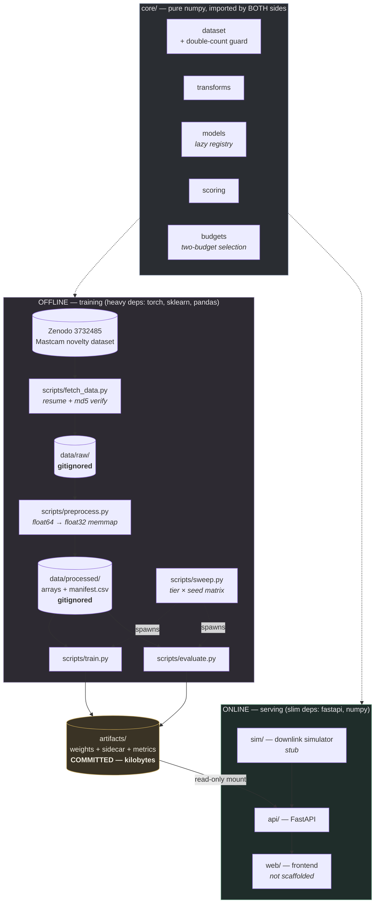

# NOVUM

**Onboard science data triage for a planetary rover.**

A rover captures far more imagery than its downlink can carry. NOVUM scores each
frame by *novelty* — how unlike previously seen terrain it is — and selects what
to transmit under **two** simultaneous budgets: **downlink bits** and **onboard
compute cycles**.

Training runs offline. The web layer only ever consumes trained weight artifacts.

---

## The problem

Curiosity has returned on the order of a million images across a decade. The
bottleneck was never the camera; it was the relay pass. A Mars orbiter is
overhead for a few minutes at a time, and the bits that fit in that window are
the only science that reaches Earth that sol.

So the interesting question is not "can a model classify Martian terrain". It is:

> Given a flight processor that is already busy driving the rover, and a
> downlink window that closes in eight minutes, which frames do you send?

That question has two constraints, and they pull in different directions:

| Budget | Scarce because | Consumed by |
|---|---|---|
| **Downlink (bits)** | the relay window is short and shared | frames you transmit |
| **Compute (cycles)** | the flight CPU is shared with driving, thermal, comms | frames you *score*, transmitted or not |

Optimising for either alone gives the wrong answer. A model good enough to
rank frames perfectly is worthless if scoring one frame costs more cycles than
the rover has between windows. A model cheap enough to run on everything is
worthless if it fills the downlink with sand.

NOVUM makes that trade-off explicit and measurable: every tier reports FLOPs per
inference alongside its ROC AUC, and selection runs under both caps at once.

---

## Architecture



### The one rule

**The web/API layer must not import torch, sklearn, or any training dependency.**

`core/` is pure numpy, so the serving image can load an artifact and score a
frame without linking a training stack. This is enforced in three places, not
just documented:

- `tests/test_no_training_deps.py` imports `api.main` in a clean subprocess and
  fails if `torch`, `sklearn`, `scipy`, `pandas`, `pyarrow` or `matplotlib`
  appear in `sys.modules`
- `docker/Dockerfile.api` runs the same check at **build** time
- `core/models/registry.py` resolves model classes lazily, so listing the
  autoencoder tiers never imports the module that would import torch

Everything is CPU-only. torch comes from the CPU wheel index; nothing in the
repo calls `.cuda()` or reads `CUDA_VISIBLE_DEVICES`.

---

## Bare server quickstart

On a fresh Ubuntu 22.04 or 24.04 box with nothing but `git`, copy-paste this:

```bash
git clone <repo> && cd novum
bash scripts/bootstrap.sh
make doctor
make setup && make data && make train && make eval
```

That is the whole thing. No manual apt installs, no prompts, no edits. Verified
end to end on a bare `ubuntu:24.04` with only `git` present, under a hard 2 GB
memory cap: bootstrap → doctor → setup → data → train → eval → 178 tests, all
green, ROC AUC 0.6385.

`bootstrap.sh` installs `make git curl unzip ca-certificates tmux python3
python3-venv python3-pip`, verifies Python is ≥ 3.10, and checks you have 12 GB
free before touching anything. It is idempotent — re-running installs nothing.
Add `--with-docker` to also install Docker Engine and the Compose plugin from
Docker's own apt repository (the distro package ships a Compose too old for
`docker-compose.yml`).

`make doctor` prints a pass/fail table for python, system binaries, disk, RAM,
the venv, dependencies, processed data and artifacts, and tells you the one
command to run next. **Run it first whenever anything breaks.** It is
stdlib-only and needs no venv, so it works before `make setup` and on an
interpreter too old to run the project.

```
  python3 >= 3.10               PASS  3.12.3  /usr/bin/python3
  binary: git                   PASS  /usr/bin/git
  free disk                     PASS  47.2 GB free
  memory                        PASS  2.0 GB
  virtualenv                    WARN  not created yet
                                      -> make setup
  data/processed                WARN  not built yet
                                      -> make data
  next: make setup
```

### Long runs belong in tmux

`make data` downloads 332 MB and `make sweep` can run for hours. A dropped ssh
session kills anything not under tmux:

```bash
tmux new -s novum                                  # start a session
make setup && make data && make train && make eval # run inside it
# detach: Ctrl-b then d      -- the work keeps going after you disconnect

tmux attach -t novum                               # reattach later
tmux capture-pane -pt novum | tail -40             # peek without attaching
```

Fully unattended, survives a dropped connection, from your laptop:

```bash
ssh user@server 'cd novum && tmux new-session -d -s novum \
  "make setup && make data && make train && make eval 2>&1 | tee runs/console.log"'
```

### Already have a working machine?

```bash
make setup          # venv + training and serving deps (CPU-only torch)
make data           # download ~332 MB, extract, convert to float32 memmaps
make train          # TIER=rad750 by default
make eval           # prints ROC AUC
make serve          # API on http://127.0.0.1:8000
```

`make help` lists every target.

The trained artifact is **committed**, so `make eval` and `make serve` work on a
fresh clone with no training step and no dataset download.

### If RAM is tight

The rad750 tier needs **no torch at all** — it is numpy only. On a 1–2 GB box,
installing torch is the only step that strains memory, and you can skip it:

```bash
make setup EXTRAS=data,serve,dev   # no torch, no scikit-learn
```

Preprocessing itself streams frame by frame and peaks near 120 MB regardless of
dataset size, so it is not the constraint. See [Memory](#memory).

### Reproducibility

`make setup` installs with `-c constraints.txt`, which pins every direct
dependency, so a run today and a run in three weeks resolve identically. The
pins are the newest releases supporting the full Python 3.10–3.13 range — the
actual latest numpy, pandas and scikit-learn all require ≥ 3.11 or ≥ 3.12 and
would break Ubuntu 22.04. `make lock` freezes the full transitive set for the
current machine into `requirements-lock.txt` (platform-specific; regenerate it
on the target rather than copying one across architectures).

---

## Model tiers

Each tier is a config, named for the class of flight processor it targets.

| Tier | Config | Model | Status |
|---|---|---|---|
| **RAD750** | `configs/tier_rad750.yaml` | PCA reconstruction error | **implemented end to end** |
| Myriad X | `configs/tier_myriad.yaml` | small conv autoencoder | stub — `NotImplementedError` |
| Snapdragon | `configs/tier_snapdragon.yaml` | larger conv autoencoder | stub — `NotImplementedError` |

The stub configs are valid and parse, so `make sweep` walks all three, records
the autoencoder tiers as `not_implemented`, and keeps going.

**RAD750 tier.** A BAE RAD750 runs at ~200 MHz with no vector unit; Curiosity
and Perseverance both fly one. Scoring must cost a handful of dot products.
PCA gives exactly that: the model is a `k × D` matrix, inference is one
matrix-vector product, and novelty is the energy the principal subspace fails
to explain. Fitting uses a **streaming randomized SVD** driven through chunked
passes over the memmap, so peak memory is `O(n·l + D·l)` rather than `O(n·D)` —
the centred design matrix at full resolution is ~900 MB, the range finder is ~8 MB.

No scikit-learn: `core/` is imported by the API, and the API has no training deps.

---

## Results

Measured on the full dataset — 9,302 training frames, evaluated on 426
`test_typical` vs 430 `test_novel_all`. This is what the committed artifact
scores; reproduce it with `make train && make eval`.

| | RAD750 (PCA, k=64) |
|---|---|
| **ROC AUC** | **0.6385** |
| Average precision | 0.6348 |
| precision@10 | 0.90 |
| precision@25 | 0.80 |
| precision@100 | 0.72 |
| Chance baseline | 0.5023 |
| Reference (conv AE, Kerner et al.) | 0.65 |
| Parameters | 399,372 |
| FLOPs / inference | 866,432 |
| Estimated cycles / frame | 2.6 M — **13% of the RAD750 budget** |
| Artifact size | 1.4 MB |
| Training wall clock | 14.8 s |
| Variance over seeds 0,1,2 | 0.6389 ± 0.0012 |

A linear model lands **0.012 below** the published conv-autoencoder reference
while fitting in an eighth of a RAD750's per-frame compute budget. That is the
whole argument for having a cheap tier at all, and it is why the autoencoder
tiers have to justify themselves rather than being assumed better.

The per-class breakdown is where it gets interesting:

| Class | n | ROC AUC | |
|---|---|---|---|
| veins | 30 | 0.941 | high-contrast mineral texture |
| broken-rock | 76 | 0.914 | |
| float | 18 | 0.881 | |
| bedrock | 11 | 0.837 | |
| meteorite | 34 | 0.797 | |
| scuff | 12 | 0.665 | |
| drill-hole | 62 | 0.599 | |
| dump-pile | 93 | 0.463 | **below chance** |
| drt | 111 | 0.423 | **below chance** |

Reconstruction error finds *texture*. It does well on veins and broken rock,
and it fails on `drt` (dust removal tool) and `dump-pile` — subtle, low-contrast
surface changes that a 64-component linear subspace reconstructs perfectly well.
Those two classes are 204 of the 451 labelled novel frames, so they drag the
aggregate number down substantially. **That failure mode is the case for the
autoencoder tiers**, and it is the first thing to check once they exist.

---

## The two-budget concept

`core/budgets.py` solves: maximise total novelty subject to
`Σ bits ≤ B_bits` **and** `Σ cycles ≤ B_cycles`. That is a 2-dimensional
knapsack — NP-hard — so NOVUM ships heuristics plus an admissible bound:

- **`greedy_sweep`** (default) — order by value per unit of blended,
  budget-normalised cost, swept over the bits/cycles blend, best kept.
  Normalising each cost by *its own* budget is what makes bits and cycles
  comparable at all; they have no common unit otherwise.
- **`score_first`** — pure novelty order. The naive baseline the simulator
  exists to beat.
- **`random`** — seeded floor.
- **`fractional_upper_bound`** — relaxing to each single constraint separately
  can only enlarge the feasible set, so the tighter of the two fractional
  optima bounds the true optimum, and every plan reports its optimality gap.

Two details that matter:

- Selection **does not stop** at the first unaffordable frame. A large frame
  says nothing about the small ones behind it, and stopping early leaves a
  measurable slice of the downlink unused.
- `binding_constraint` asks which budget actually *blocked* the frames left
  behind, not which one is closest to full. A cycle budget of 350 against
  frames costing 100 each is completely binding at 300 used — 86% utilisation,
  and not one more frame fits.

See it run: `python -m scripts.evaluate --budget-demo`.

---

## Dataset

**Mars novelty detection Mastcam labeled dataset** — Kerner et al.
Zenodo record [3732485](https://doi.org/10.5281/zenodo.3732485), **CC-BY-4.0**.

Derived from Mastcam multispectral imagery acquired by the Mars Science
Laboratory *Curiosity* rover, archived by the **NASA Planetary Data System
(PDS) Imaging Node**. Original data courtesy NASA/JPL-Caltech/MSSS.

> Kerner, H. R., Wagstaff, K. L., Bue, B. D., Gray, P. C., Bell, J. F., and
> Ben Amor, H. *Toward Generalized Change Detection on Planetary Surfaces with
> Convolutional Autoencoders and Transfer Learning.* IEEE JSTARS, 2019.
> Dataset: Kerner et al., Zenodo, 2020.

Each sample is a `.npy` of shape `(64, 64, 6)`, float64, 196,736 bytes — a
64×64 tile across six Mastcam filter bands. Counts verified against the archive:

| Split | Frames | Archive |
|---|---|---|
| `train_typical` | 9,302 | 257.6 MB |
| `validation_typical` | 1,386 | 36.7 MB |
| `test_typical` | 426 | 12.1 MB |
| `test_novel` | 881 total | 25.9 MB |

Reference point from the literature: **ROC AUC 0.65** for a convolutional
autoencoder on this dataset. `evaluate.py` prints it next to every result, so a
number is never reported without its context.

### The `test_novel` gotcha

`test_novel/` contains eleven per-class folders (`meteorite`, `veins`,
`drill-hole`, `broken-rock`, `dump-pile`, `drt`, `scuff`, `float`, `bedrock`,
`edge_cases`, `other`) **and** an `all/` folder. Verified against the archive:

- `all/` holds **430** files; the class folders hold **451** (446 unique names)
- `all/` filenames are a **strict subset** of the class-folder names
- the files are **byte-identical** between `all/` and their class copy
- **5 filenames appear in two class folders each** — genuinely multi-label
- 16 class-folder frames are *not* in `all/`

So `glob('test_novel/**/*.npy')` returns **881 paths for at most 446 distinct
frames**, inflating the evaluation set ~2× and silently corrupting every metric.

NOVUM materialises two splits that are never concatenated:

| Split | Rows | Meaning |
|---|---|---|
| `test_novel_all` | 430 | **canonical evaluation set**, one row per frame |
| `test_novel_byclass` | 451 | per-class breakdown, one row per *(frame, label)* |

Frames in `test_novel_all` get their class resolved by joining on filename, so a
multi-label frame is labelled `drill-hole\|dump-pile`. This is enforced, not
documented:

- `preprocess._assert_novel_not_double_counted` — hard `DoubleCountError` if
  `all/` leaks into the per-class walk, or if the canonical set has duplicates
- `core.dataset.concat_splits` — refuses the pair outright
- `core.config.validate_config` — rejects `eval.novel_split: test_novel_byclass`

### Filenames and sols

Filenames encode the sol (Martian day) and camera, in inconsistent formats:

```
mcam00487_R0_sol0069_7.npy      -> sol 69,  camera R
mcam00117_MR_0_sol0024_39.npy   -> sol 24,  camera MR
```

Parsing is tolerant by contract (`sol(\d+)`, case-insensitive): an unrecognised
name yields `None` and a **warning**, never an exception — one odd filename must
not abort a 9,000-file run. The sol lands in the manifest because the simulator
replays frames in **chronological sol order**, which is the only ordering under
which "novel" keeps its meaning: *unlike the terrain seen so far*. Unparseable
sols sort **last**, never first, so they cannot seed the baseline.

### Data policy

- **Raw and processed data are never committed.** `data/` and `runs/` are gitignored.
- **Artifacts are committed.** `artifacts/*.npz` plus sidecars and metrics are
  kilobytes to a few megabytes, so the demo runs with no training step.
- **Secrets only via `.env`.** `.env.example` is committed; `.env` never is.

---

## Pipeline

### `fetch_data.py`
Downloads the four archives with a progress indicator, **resume** via HTTP Range
(Zenodo returns 206 — verified), and **checksum caching**. md5s come from the
Zenodo API with the published values embedded as an offline fallback; a verified
file is recorded in `.fetch_cache.json` so re-runs skip it without re-hashing
250 MB. Extraction guards against zip-slip and symlinks. Re-running costs a few
stat calls.

### `preprocess.py`
Converts each split into one contiguous memory-mapped **float32** `.npy` plus
`manifest.csv` (columns: `index, split, class, sol, source_filename`; parquet too
when pyarrow is present). Source frames are float64 but hold 8-bit DN values, so
float32 is lossless here and **halves** the on-disk footprint. Idempotent: each
split is fingerprinted by its input file list, and an unchanged split is skipped.
Writes are atomic — temp file then rename — so an interrupted run never leaves a
half-written array behind.

### `train.py`
```bash
python -m scripts.train --config configs/tier_rad750.yaml --out artifacts/rad750.npz
```
Writes weights plus a sidecar JSON with **config hash, git commit, wall-clock
time, parameter count, estimated FLOPs per inference, and peak RSS**. Peak RSS
handles the `ru_maxrss` unit difference between Linux (KiB) and macOS (bytes) —
getting that wrong reports a 1 GB run as 1 MB. Exit code **3** means "this tier
is a stub", which is how `sweep.py` tells a stub from a genuine failure.

### `evaluate.py`
Scores `test_typical` vs `test_novel_all`, reports ROC AUC, average precision,
precision@k and recall@k, plus a per-class AUC breakdown. Metrics land in
`runs/metrics/<name>.json` and are published to `artifacts/metrics/<name>.json`
so the committed numbers travel with the committed weights.

Metrics are numpy, not sklearn: `roc_auc` uses the Mann-Whitney U identity with
mid-rank tie handling and agrees with sklearn to floating point (there is a test
for that, skipped unless sklearn happens to be installed). `precision_at_k`
breaks boundary ties **pessimistically**, so the number never flatters the model.

### `sweep.py`
Runs a (tier × seed) matrix sequentially, one run per subprocess so peak RSS
means something. Logs each run to `runs/sweep/<timestamp>/logs/`, and rewrites
`results.csv`, `results.md` and `results.json` **after every run**, so a sweep
killed at hour six still has everything up to hour six. `SIGINT`/`SIGTERM` finish
the current write and exit cleanly.

---

## Run on a remote server

Ubuntu 22.04 or 24.04, no GPU, nothing installed but `git`. Everything below is
copy-pasteable.

```bash
# 1. Connect
ssh user@your-server

# 2. Clone
git clone https://github.com/you/novum.git
cd novum

# 3. Install system packages (idempotent, non-interactive, no prompts).
#    Add --with-docker if you want the `make docker-*` targets: it uses
#    Docker's own apt repo, because the distro package ships a Compose too
#    old for docker-compose.yml.
bash scripts/bootstrap.sh

# 4. Confirm the box is sane before spending an hour on it
make doctor

# 5. Start a detached-safe session BEFORE anything long-running
tmux new -s novum

# 6. Inside tmux: build the environment and the dataset
make setup                    # ~4 min (CPU-only torch is the slow part)
make data                     # ~332 MB download + extract + convert

# 7. Train and evaluate
make train TIER=rad750
make eval

# 8. Or run the whole matrix unattended
make sweep TIERS=rad750,myriad,snapdragon SEEDS=0,1,2
```

Detach with **`Ctrl-b` then `d`**. The session keeps running after you disconnect.

```bash
# Reattach later
ssh user@your-server
tmux attach -t novum

# Check on it without attaching
tmux capture-pane -pt novum | tail -40
cat runs/sweep/latest/results.md
```

One-liner for a fully unattended sweep that survives a dropped connection:

```bash
ssh user@your-server 'cd novum && tmux new-session -d -s sweep \
  "make setup && make data && make sweep 2>&1 | tee runs/sweep-console.log"'
```

Progress output detects that it is not on a terminal and switches from a
redrawing bar to periodic newline-terminated lines, so `tee`, `nohup` and
`tmux capture-pane` all stay readable. Force it either way with
`NOVUM_PLAIN_PROGRESS=1`.

### Docker

```bash
make docker-train    # heavy image: fetch + preprocess + train + eval
make docker-serve    # slim image: API only, artifacts mounted READ-ONLY
```

Two images by design. `Dockerfile.train` carries the training stack;
`Dockerfile.api` carries FastAPI, uvicorn, numpy and pyyaml, and **fails the
build** if a training dependency becomes reachable. `docker-compose.yml` mounts
`artifacts/` read-only into the API — serving must not be able to modify a
trained artifact — and includes a commented-out Caddy service for HTTPS.

### Storage

Measured on this dataset:

| | |
|---|---|
| Archives | 332 MB |
| Extracted float64 | ~2.3 GB |
| Processed float32 | 1.1 GiB (872 MiB of it `train_typical`) |
| Virtualenv with CPU torch | ~2.8 GB |
| **`bootstrap.sh` requires** | **12 GB free** |
| `make data` wall clock | ~2 min download + 7 s preprocess |
| `make train` wall clock | 15 s |

`data/` can live on another volume: `export NOVUM_DATA_DIR=/mnt/scratch/novum`.

### Memory

The target is a 2 GB server, so memory is a design constraint, not an
afterthought.

**Preprocessing is O(1) in dataset size.** It holds exactly one 192 KB source
frame at a time and appends it to a preallocated file through a buffered
handle. Measured per split:

| Split | Frames | Output | Peak RSS |
|---|---|---|---|
| `test_typical` | 426 | 40 MiB | 99.6 MiB |
| `validation_typical` | 1,386 | 130 MiB | 100.8 MiB |
| `train_typical` | 9,302 | 872 MiB | **113.0 MiB** |

21× the frames, 21× the output, 13 MiB more RSS. The residual growth is the
per-frame manifest metadata, which is genuinely O(n) and costs ~50 MiB across
the whole dataset.

Verified end to end on Ubuntu 24.04 inside a hard 2 GB cgroup cap: all five
splits (11,995 frames, 1.1 GiB written) preprocess at **139 MiB peak RSS**.

This was not free. The obvious implementation — assigning into a
`np.lib.format.open_memmap` array — dirties one page per frame and the kernel
holds them resident until writeback, so building `train_typical` peaked at
**914 MiB for an 872 MiB array**: the entire output, in RAM, and an OOM kill on
a 2 GB box. `StreamingArrayWriter` in `scripts/preprocess.py` exists for that
reason, and `tests/test_preprocess_memory.py` measures the marginal RSS per
frame across two dataset sizes so the regression cannot come back quietly.
`preprocess.py` also reports its own peak RSS every run and warns past 500 MB.

**Training is the memory-hungry step, not preprocessing.** rad750 peaks at
1.4–1.6 GB, dominated by mapped pages of the training array plus a 218 MiB
in-RAM copy of the transformed design matrix — the randomized SVD itself holds
~8 MB. Mapped file pages are reclaimable, so that is not 1.4 GB of *required*
RAM; it completed inside the 2 GB cap above with room to spare, and runs on a
smaller box with more disk reads. To lower it deliberately:

```yaml
model:
  memory_budget_bytes: 0    # drop the 218 MiB copy, force the streaming path
data:
  max_train_samples: 4000   # reduce the mapped footprint itself
```

Both paths compute identical arithmetic — there is a test asserting that.

**Installing torch is the real 2 GB risk**, not anything NOVUM runs. rad750
needs no torch, so on a tight box use `make setup EXTRAS=data,serve,dev`, or
add swap.

`data/` can live on another volume: `export NOVUM_DATA_DIR=/mnt/scratch/novum`.

---

## Layout

```
core/            pure numpy: dataset, transforms, models, scoring, budgets
scripts/
  bootstrap.sh   bare-server provisioning (apt, python check, optional docker)
  doctor.py      environment diagnosis — stdlib only, runs before any install
  fetch_data.py  resumable, checksum-verified Zenodo download
  preprocess.py  streaming float32 conversion + manifest
  train.py       tier training + provenance sidecar
  evaluate.py    ROC AUC, precision@k, per-class breakdown
  sweep.py       unattended (tier x seed) matrix
configs/         tier_rad750.yaml (implemented), tier_myriad, tier_snapdragon
constraints.txt  pinned direct dependencies (Python 3.10–3.13 compatible)
artifacts/       trained weights + sidecars + metrics — COMMITTED
data/            raw and processed — gitignored
runs/            logs, sweep output, metrics — gitignored
sim/             downlink window simulator — replay() is a stub
api/             FastAPI — artifact endpoints live, scoring returns 501
web/             placeholder, not scaffolded
docker/          Dockerfile.train, Dockerfile.api, docker-compose.yml
tests/           179 tests: dependency separation, double counting, memory bounds
```

## What is a stub

Everything below is explicitly marked and raises `NotImplementedError` with an
actionable message:

- `core/models/conv_ae.py` — both autoencoder tiers (configs are valid and parse)
- `sim/window.py` — `replay()`; `plan_windows` and `chronological_order` are real
- `api/main.py` — `POST /api/score` and `GET /api/simulate` return 501
- `web/` — empty by intent

## Development

```bash
make doctor          # diagnose the environment — start here
make doctor STRICT=1 # warnings are failures too (for CI)
make test            # pytest
make check-deps      # just the dependency-separation guard
make lint            # ruff
make lock            # freeze the transitive dep set for this machine
```

Three tests encode the invariants that are easy to break by accident and hard
to notice:

| Test | Guards |
|---|---|
| `test_no_training_deps.py` | the API never imports torch/sklearn/pandas |
| `test_double_counting.py` | `test_novel/all/` never merges with the class folders |
| `test_preprocess_memory.py` | preprocessing stays O(1) in dataset size |
| `test_bootstrap_and_doctor.py` | `doctor.py` stays stdlib-only and old-Python parseable |

## License

Code MIT. The dataset is CC-BY-4.0 (Kerner et al.) and is not redistributed here —
`fetch_data.py` downloads it from Zenodo at first run.
